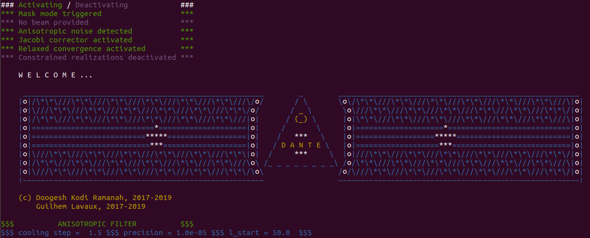

# DANTE
Performs Wiener filtering and pure E/B reconstruction on the sphere with complex noise models

# DANTE for spin field reconstruction on the sphere

**Please cite the paper below if you make use of the code:**  
"*Wiener filtering and pure E/B decomposition of CMB maps with anisotropic correlated noise*,"  
Doogesh Kodi Ramanah, Guilhem Lavaux, Benjamin D. Wandelt ([arXiv link](https://arxiv.org/abs/1906.10704))

### DANTE (DuAl messeNger filTEr) is designed to perform Wiener filtering and pure E/B decomposition on the sphere. The current version has the following (optional) features:

* Any arbitrary masks for I/Q/U (in `.fits` format)
* Inclusion of a beam
* Jacobi relaxation scheme to correct for non-orthogonality of spherical harmonic transforms
* A modified convergence scheme for speed-ups
* Generation of constrained realizations

### and allows for two possible noise models:

* Gaussian white noise (with I/Q/U correlations) - *Noise model A*
* Anisotropic correlated noise (spatial correlations + 1/f noise behaviour typical of Planck-like missions) - *Noise model B*

*Note:* Pure E/B decomposition can currently be done only with noise model B, but the same principles apply for the noise model A. This functionality will be added in a future release.

# DANTE dependencies

DANTE relies on the following standard `Python` packages and is compatible with both `Python2` and `Python3`:

* `healpy`: for spherical harmonic transforms (SHTs)
* `numba`: for generating efficient parallelized machine/native code for array manipulations on the sphere
* `astropy`: for handling `.fits` data files
* `tqdm`: for progress bar visualization

# Code organization

The key modules are as follows:

* `wiener.py`: Initialization phase. Contains the `WienerFilter` class, which loads the relevant data files (maps, mask, beam etc.) using the `Observations` class
* `dual_messenger.py`: Core of the $\mathrm{DANTE}$ package. Contains the `DualMessenger` class, which performs the reconstructions using `run_classic_filter` or `run_anisotropic_filter` (depending on choice of noise model)
* `dual_messenger_tools.py`: Library of useful and generic tools for array manipulations and algebraic computations etc.
* `observations.py`: Responsible for loading the data files, employed in the `WienerFilter` class
* `mock.py`: Provides several tools for mock validation purposes
